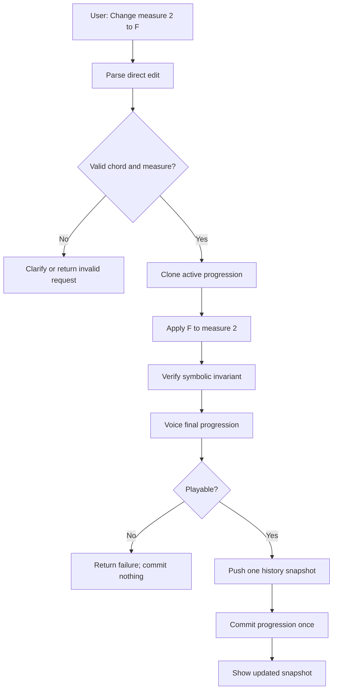
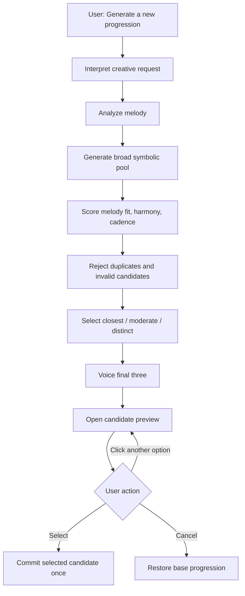
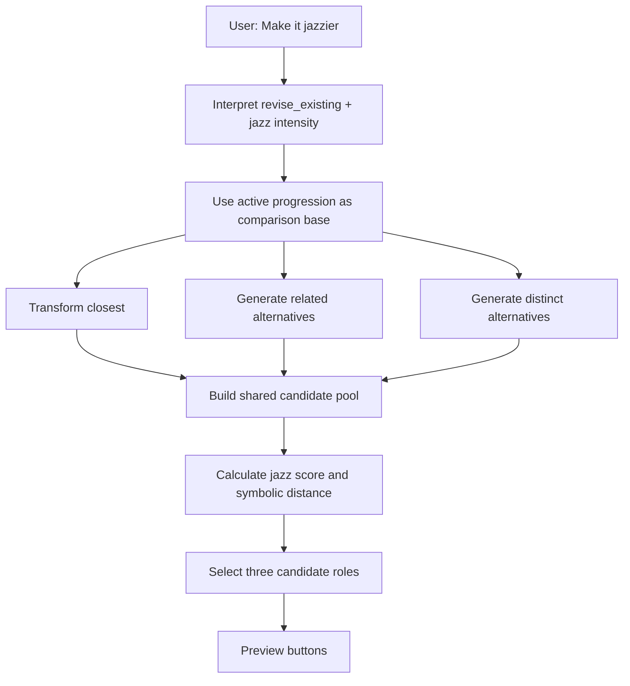
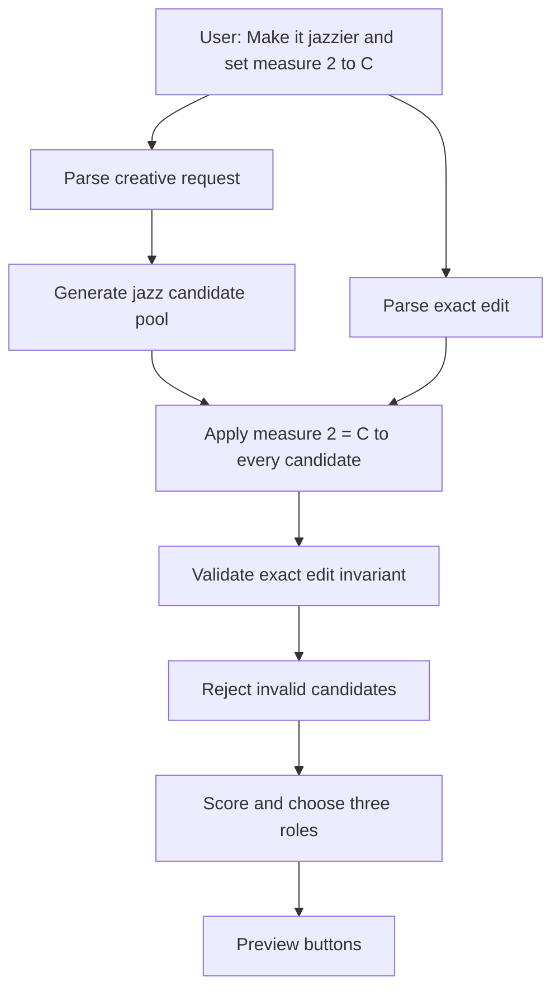
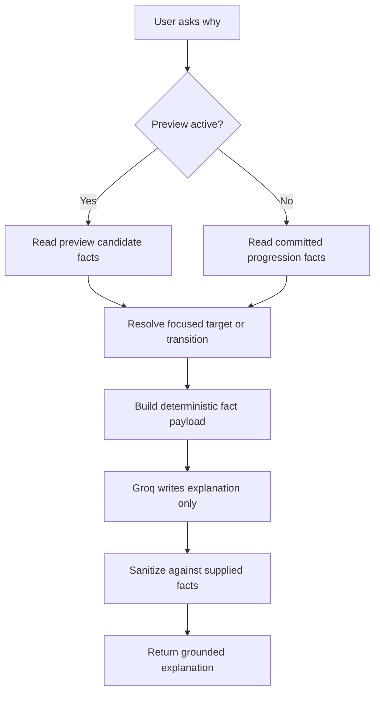

# PLANNING3.md — Chord Finder Candidate-Preview Architecture

## 1. Purpose

This document defines the next architecture for Chord Finder after the experimental harmony-chat refactor.

The goal is to preserve the useful ideas from the experiment while avoiding the problems that appeared:

- giant uncommitted refactors;
- multiple overlapping execution paths;
- ordinary chord edits accidentally becoming persistent locks;
- unclear distinction between temporary previews and committed progressions;
- style requests that silently produced no meaningful change;
- success messages that did not match the actual final progression;
- overly broad natural-language handling;
- incomplete combined prompts being partially executed;
- explanation logic inventing theory that was not grounded in deterministic facts;
- state becoming harder to revise later in a long chat.

The new architecture should make each type of request explicit, deterministic, and easy to test.

---

## 2. Product principles

### 2.1 Creative requests produce options

Requests with multiple valid musical answers should produce a candidate set rather than silently choosing one progression.

Examples:

- “Give me a progression.”
- “Make it jazzier.”
- “Make it simpler.”
- “Generate a new progression with a descending bass.”
- “Make it jazzier but keep measure 2 as C for these options.”

The user sees three candidate buttons, previews them on the staff, listens, and chooses **Select** or **Cancel**.

### 2.2 Exact requests apply directly

Requests with one deterministic result should not create three buttons.

Examples:

- “Change measure 2 to C.”
- “Set the progression to F–G–C–G.”
- “Copy measure 1 to measure 4.”
- “Replace every Cmaj7 with Dm7.”

These update the active progression immediately after deterministic validation and voicing.

### 2.3 Ordinary edits are not locks

“Change measure 2 to F” means:

- use F now;
- remember that the user requested it for explanation/history;
- allow every chord to be reconsidered during later creative revisions.

It does **not** mean:

- preserve measure 2 forever;
- shrink future generation;
- lock the measure during “make it jazzier.”

Explicit lock commands may be added later, but they are outside the current scope.

### 2.4 Groq interprets language; TypeScript owns music

Groq may determine:

- request category;
- style;
- valence/intensity;
- whether the request is relative or absolute;
- exact chord references;
- requested structural constraints;
- whether clarification is needed.

Groq must not determine:

- execution order;
- chord validity;
- scope validity;
- candidate quality;
- Roman numeral analysis;
- melody fit;
- voicing;
- whether a progression is playable;
- whether the final result actually satisfies the request.

### 2.5 Preview is not commit

Candidate previews are temporary.

- Clicking a candidate updates the staff for playback.
- Previewing does not create permanent history.
- Previewing does not change the base progression used to build the candidate set.
- **Select** commits one candidate.
- **Cancel** restores the exact base progression and state from before the candidate set opened.

---

## 3. Request categories

The top-level interpreter should classify every message into one of four buckets:

```ts
type HarmonyIntent =
  | "generate_new"
  | "revise_existing"
  | "direct_edit"
  | "answer_question"
  | "clarify";
```

### 3.1 `generate_new`

Use when the user wants a fresh progression independent of the current harmonic structure.

Examples:

- “Generate a progression.”
- “Give me another one.”
- “Make a new jazzy progression.”
- “Give me something I have not seen before.”
- Blank prompt when no progression exists.

Expected behavior:

- create a new candidate set;
- all measures are eligible to change;
- prior exact edits do not constrain the result;
- the active melody, key, style, and structural constraints still matter.

### 3.2 `revise_existing`

Use when the user wants to preserve some recognizable relationship to the current progression while changing its treatment.

Examples:

- “Make this jazzier.”
- “Simplify this.”
- “Give me three alternatives based on this progression.”
- “Keep the same general feel but make it richer.”

Expected behavior:

- candidate 1 remains closest to the current progression;
- candidate 2 is moderately different;
- candidate 3 is distinct;
- ordinary prior edits are not locked;
- the current progression is the comparison base, not a hard template.

### 3.3 `direct_edit`

Use when the user specifies the desired result closely enough that creative search is unnecessary.

Examples:

- “Change measure 2 to F.”
- “Set the progression to F–G–C–G.”
- “Copy measure 1 to measure 4.”
- “Replace Cmaj7 with Dm7.”

Expected behavior:

- parse;
- validate;
- apply to temporary symbolic state;
- voice;
- verify the final progression satisfies the edit;
- commit once;
- show one direct result, no candidate buttons.

### 3.4 `answer_question`

Use for explanation or factual questions about the current progression.

Examples:

- “Why did you choose G7?”
- “Explain the move from Am to E7.”
- “Which chord is the dominant?”
- “Why is candidate 1 closest to the current progression?”

Expected behavior:

- do not modify the progression;
- answer only from deterministic facts;
- focus on the requested target or transition;
- never surface internal prompt text.

### 3.5 `clarify`

Use when the user’s request cannot be resolved safely.

Examples:

- “Add Fmaj7” with no placement preference, if the product chooses not to auto-place;
- “Make it better” with no interpretable musical meaning;
- conflicting exact edits to the same measure;
- one clause is unsupported while another is valid.

Expected behavior:

- preserve the full request context;
- ask one precise question;
- do not execute any recognized subset.

---

## 4. High-level request model

Avoid one unconstrained list of arbitrary operations.

Use a request shape that separates creative generation from exact edits:

```ts
type HarmonyRequest = {
  intent: HarmonyIntent;
  creative?: CreativeRequest;
  exactEdits: ExactEdit[];
  question?: HarmonyQuestion;
  clarification?: ClarificationRequest;
};

type CreativeRequest = {
  mode: "generate_new" | "revise_existing";
  style?: StyleIntent;
  constraints: GenerationConstraints;
  novelty?: NoveltyIntent;
};

type ExactEdit =
  | SetMeasureChordEdit
  | SetProgressionEdit
  | CopyChordEdit
  | ReplaceMatchingChordEdit;

type GenerationConstraints = {
  bassMotion?: "descending" | "ascending" | "smooth";
  melodyFitPriority?: "normal" | "high";
  ending?: "tonic" | "dominant" | "open";
};
```

Execution rule:

```text
creative only
→ build candidate set

exact edits only
→ direct apply

creative + exact edits
→ build creative candidate set
→ apply exact edits to every candidate
→ validate every final candidate
→ show surviving candidate set
```

This is intentionally narrower than a general-purpose operation engine.

---

## 5. Candidate-set architecture

### 5.1 First-class candidate state

```ts
type CandidateRole = "closest" | "moderate" | "distinct";

type ProgressionCandidate = {
  id: string;
  role: CandidateRole;
  progression: ScoredChord[];
  voicedProgression: PlacedChord[][];
  scoreSummary: CandidateScoreSummary;
  explanationFacts: CandidateExplanationFacts;
  symbolicHash: string;
};

type CandidateSet = {
  id: string;
  baseProgression: ScoredChord[] | null;
  baseVoicedProgression: PlacedChord[][] | null;
  baseInterpretation: InterpretedStyle | null;
  request: HarmonyRequest;
  candidates: ProgressionCandidate[];
  previewedCandidateId: string;
  status: "previewing" | "selected" | "cancelled";
};
```

### 5.2 Candidate button behavior

Each visible button corresponds to one candidate.

Suggested labels:

- **Option 1 — Closest**
- **Option 2 — More Different**
- **Option 3 — Fresh Alternative**

Each button should show a compact progression label:

```text
Option 1 — Closest
Cmaj7 – Am7 – Fmaj7 – G7
```

Clicking a button:

1. changes only `previewedCandidateId`;
2. displays that candidate on the staff;
3. allows playback;
4. does not push history;
5. does not update the permanent current progression;
6. does not assign a saved progression number.

### 5.3 Select button

**Select** commits the currently previewed candidate.

It should:

1. validate that the candidate still exists;
2. set it as the active symbolic progression;
3. set its voiced progression on the staff;
4. update interpretation/style state;
5. push exactly one history entry containing the prior committed state;
6. append a normal chat snapshot;
7. close candidate-preview mode;
8. preserve a session identity for later references;
9. avoid automatic explanation unless requested.

### 5.4 Cancel button

**Cancel** closes candidate-preview mode and restores the exact base state.

It should restore:

- symbolic progression;
- voiced progression;
- current interpretation;
- any explanation context;
- the previously committed staff display.

It should not:

- push history;
- create a new progression identity;
- alter the chat messages already shown;
- select a fallback candidate.

### 5.5 Previous candidate sets

Earlier candidate buttons may remain visible in chat.

Clicking an older candidate should:

- preview it again;
- not silently overwrite current committed state;
- present **Select** and **Cancel** relative to the current committed progression;
- create a new preview transaction rather than resurrecting stale internal references.

---

## 6. When buttons should appear

### Buttons should appear

- generate-new requests;
- revise-existing style requests;
- requests for “another,” “different,” or “more options”;
- creative requests with exact constraints;
- structural requests with multiple plausible answers;
- “give me something I have not seen before”;
- requests where comparison and playback are useful.

Examples:

- “Make it jazzier.”
- “Give me a new simple progression.”
- “Make it jazzier but set measure 2 to C.”
- “Give me a progression with descending bass.”
- “Keep the same feeling but make it more colorful.”

### Buttons should not appear

- exact measure edits;
- exact progression replacement;
- copy/replace commands;
- undo;
- explanation requests;
- clarification responses such as “measure 3” or “anywhere”;
- unsupported requests;
- empty state-management commands.

Examples:

- “Change measure 2 to C.”
- “Use F–G–C–G.”
- “Copy measure 1 to measure 4.”
- “Undo.”
- “Explain Am to E7.”

---

## 7. Candidate generation strategy

Do not ask one generator for “the top three” and hope they are diverse.

Generate a broader validated pool, then select three candidates for explicit roles.

### 7.1 Recommended pipeline

```text
analyze melody
→ resolve style and constraints
→ generate broad symbolic pool
→ apply style transforms
→ apply exact edits to every candidate
→ score
→ reject invalid/unplayable/duplicate candidates
→ assign closest/moderate/distinct roles
→ voice final three
→ show buttons
```

### 7.2 Internal pool size

Start with a modest configurable pool:

```ts
const DEFAULT_POOL_SIZE = 12;
```

The pool may include:

- candidates from the current best-fit generator;
- related substitutions;
- style-transformed versions;
- distinct generated alternatives;
- fallback candidates.

Do not expose all pool candidates to the user.

### 7.3 Candidate-role selection

#### Option 1 — Closest

Goal:

- highest-quality candidate with low symbolic distance from the current progression;
- preserve broad harmonic contour when possible;
- visibly satisfy the requested style.

Possible distance features:

- same Roman numeral in same measure;
- same root class;
- same cadence;
- same functional family;
- same bass contour.

#### Option 2 — Moderate

Goal:

- preserve some recognizable material;
- change enough to feel meaningfully different;
- avoid being a mere reordering of candidate 1.

Possible rule:

- require at least one or two symbolic differences;
- preserve no more than two exact positions;
- maintain strong melody and cadence scores.

#### Option 3 — Distinct

Goal:

- maximize valid symbolic distance while maintaining musical quality;
- exclude the current progression and candidates 1–2;
- allow a fresh harmonic structure.

### 7.4 Fallback candidates

Generate reserve candidates beyond the three visible options.

A candidate fails when:

- duplicate of current progression;
- duplicate of another selected candidate;
- fails exact edits;
- fails voicing;
- exceeds dissonance threshold;
- violates melody/key constraints;
- does not visibly satisfy the requested style;
- is too similar for its assigned role.

If a role has no valid candidate:

- try reserve candidates;
- relax only documented nonessential diversity thresholds;
- never fake success;
- show fewer than three options only if the UI supports it clearly;
- otherwise return a specific no-options response.

---

## 8. Jazz style architecture

### 8.1 Jazz is a deterministic transform family

```ts
type StyleIntent = {
  style: "jazz" | "simple";
  intensity: StyleIntensity;
  adjustment: "absolute" | "increase" | "decrease";
  wholeProgression: boolean;
};

type StyleIntensity = 0 | 1 | 2 | 3 | 4;
```

Suggested interpretation:

- `0`: no style transform;
- `1`: subtle;
- `2`: normal;
- `3`: strong;
- `4`: maximum supported.

### 8.2 Jazz transforms

```ts
type JazzTransform = {
  id: string;
  minimumIntensity: StyleIntensity;
  isApplicable(context: TransformContext): boolean;
  produceCandidates(
    progression: ScoredChord[],
    context: TransformContext,
  ): ScoredChord[][];
};
```

Initial transform set:

1. `convertEligibleTriadsToSevenths`
2. `addCompatibleColorExtensions`
3. `introduceSecondaryDominants`
4. `applyEligibleTritoneSubstitutions`
5. `applyBackdoorOrMinorCadenceAlternatives`

### 8.3 Intensity behavior

#### Level 1 — subtle

- one safe seventh conversion;
- preserve most roots and functions;
- avoid chromatic substitutions.

#### Level 2 — normal

- multiple seventh conversions;
- one compatible extension;
- optional functional dominant color.

#### Level 3 — strong

- more extensions;
- secondary dominant where target is valid;
- altered cadence candidate where musically justified.

#### Level 4 — maximum

- explore tritone substitutions and backdoor/minor cadence alternatives;
- still require melody fit, valid resolution, and playability;
- do not apply advanced transforms where context is absent.

Intensity controls which transforms become eligible. It does not mean every transform must run.

### 8.4 Jazz validation

A “jazzier” candidate must be measurably more colorful than the base progression.

Possible deterministic style score:

```ts
jazzColorScore =
  seventhCount * w7 +
  extensionCount * wExtension +
  secondaryDominantCount * wSecondary +
  tritoneSubCount * wTritone +
  backdoorCadenceCount * wBackdoor;
```

Candidate 1 may be subtle, but all visible jazz candidates should improve the score unless the current progression is already at the maximum supported level.

---

## 9. Simplify architecture

### 9.1 Simplicity uses a deterministic complexity scale

Suggested chord-complexity ranking:

```text
triad
sus
add9
seventh
ninth
eleventh
thirteenth
altered/chromatic substitute
```

This should be represented by a pure function:

```ts
function getChordComplexity(chord: Chord): number;
```

### 9.2 Simplify transforms

Possible helpers:

1. remove 13ths;
2. remove 11ths;
3. remove 9ths/add9;
4. remove unnecessary sevenths;
5. resolve suspensions to major/minor triads;
6. replace altered/chromatic substitutes with simpler functional chords;
7. prefer a tonic ending when compatible with the melody.

### 9.3 Intensity behavior

#### Level 1 — subtle

- simplify at least one eligible chord;
- preserve most functions and roots.

#### Level 2 — normal

- remove several extensions;
- permit one functional V7;
- prefer triads or simple suspensions.

#### Level 3 — strong

- mostly triads;
- remove add9 and nonessential sevenths;
- resolve suspensions where musically reasonable.

#### Level 4 — maximum

- plain major/minor triads wherever valid;
- allow only essential functional exceptions;
- report already-simple only after exhaustive eligible simplification attempts.

### 9.4 Simplicity validation

A simple candidate should have a lower deterministic complexity score than the base progression.

Do not claim success merely because preferences changed.

---

## 10. Parsing valence and conversational phrasing

### 10.1 Groq output

Groq should return structured interpretation, not music:

```ts
type ParsedStyleLanguage = {
  style?: "jazz" | "simple";
  intensity?: StyleIntensity;
  adjustment?: "absolute" | "increase" | "decrease";
  mode?: "generate_new" | "revise_existing";
  wholeProgression?: boolean;
  constraints?: GenerationConstraints;
  exactEdits?: ParsedExactEdit[];
  unsupportedClauses?: string[];
};
```

### 10.2 Valence examples

| User phrase                     | Normalized result   |
| ------------------------------- | ------------------- |
| “slightly jazzy”                | jazz, intensity 1   |
| “jazzy”                         | jazz, intensity 2   |
| “very/really/super jazzy”       | jazz, intensity 3   |
| “as jazzy as possible”          | jazz, intensity 4   |
| “a little simpler”              | simple, intensity 1 |
| “make it much simpler”          | simple, intensity 3 |
| “make it as simple as possible” | simple, intensity 4 |
| “make it jazzier”               | jazz, increase 1    |
| “make it way jazzier”           | jazz, increase 2    |
| “less jazzy”                    | jazz, decrease 1    |

### 10.3 Conversational negation

The phrase:

```text
“That is not very jazzy; do more.”
```

should normalize to:

```ts
{
  style: "jazz",
  adjustment: "increase",
  intensity: 3
}
```

It should not mechanically interpret `not very jazzy` as low jazz intensity.

Groq may infer conversational meaning, but TypeScript must:

- validate the enum;
- clamp intensity to `0–4`;
- reject contradictory interpretations;
- preserve unsupported clauses;
- never silently drop one clause from a combined request.

### 10.4 Completeness policy

For:

```text
“Make it jazzier and change C/E to D and Gsus4 to Fmaj7.”
```

all clauses must become either:

- a creative request;
- a valid exact edit;
- a clarification;
- an explicit unsupported clause.

If only part is parsed, nothing executes.

---

## 11. Exact edits

### 11.1 Supported direct edits

Initial direct-edit set:

```ts
type ExactEdit =
  | {
      type: "set_measure_chord";
      measure: number;
      chord: ParsedChordSymbol;
    }
  | {
      type: "set_progression";
      chords: [
        ParsedChordSymbol,
        ParsedChordSymbol,
        ParsedChordSymbol,
        ParsedChordSymbol,
      ];
    }
  | {
      type: "copy_measure_chord";
      fromMeasure: number;
      toMeasure: number;
    }
  | {
      type: "replace_matching_chord";
      from: ParsedChordSymbol;
      to: ParsedChordSymbol;
    };
```

### 11.2 Direct-edit transaction

```text
parse exact edit
→ validate chord and measure
→ clone current symbolic progression
→ apply edit
→ verify symbolic result
→ voice final progression
→ verify final result still satisfies edit
→ push one history entry
→ commit once
→ show direct snapshot
```

### 11.3 Success invariant

Never display:

```text
“Set measure 2 to F.”
```

unless the final committed symbolic progression actually contains `F` in measure 2.

### 11.4 Direct edits inside creative requests

Example:

```text
“Make it jazzy but make measure 2 C.”
```

Flow:

1. generate jazz candidate pool;
2. apply `set_measure_chord(2, C)` to every candidate;
3. reject candidates that fail;
4. rank surviving candidates;
5. show buttons.

The exact edit is not permanent after selection. It is simply part of the selected result.

---

## 12. Generate new vs revise existing

### Generate new

- current progression is not a structural template;
- all measures may change;
- novelty and melody fit matter;
- user may request unseen alternatives;
- candidate roles compare to the old progression only for diversity, not preservation.

### Revise existing

- current progression is the comparison base;
- option 1 should remain recognizably related;
- option 2 should retain some relationship;
- option 3 may be substantially different;
- no chord is automatically locked;
- revision quality is measured relative to the current progression and request.

### Distinguishing phrases

| Phrase                               | Mode            |
| ------------------------------------ | --------------- |
| “Make this jazzier”                  | revise existing |
| “Give me a new jazzy progression”    | generate new    |
| “Try another one”                    | generate new    |
| “Keep the same feel but simplify it” | revise existing |
| “Start over with something simple”   | generate new    |
| “Make it slightly different”         | revise existing |

---

## 13. Explanations

### 13.1 Explanation facts

Each committed or preview candidate should retain deterministic facts:

```ts
type CandidateExplanationFacts = {
  activeKey: string;
  chordFacts: MeasureChordFacts[];
  candidateRole?: CandidateRole;
  relationToBase?: CandidateRelationFacts;
  requestSummary: string;
};
```

### 13.2 User-request provenance

If an exact edit was applied, explanation metadata may say:

```text
“Measure 2 is C because you explicitly requested C in that measure.”
```

This metadata must not affect generation or future revisions.

### 13.3 Candidate-role explanations

While previewing:

- Option 1: explain that it is closest to the base and what changed;
- Option 2: identify which functions or positions differ;
- Option 3: explain that it is the most structurally distinct valid option.

### 13.4 Grounding requirements

Do not claim:

- melody fit without deterministic evidence;
- ii–V–I without actual analysis;
- suspension resolution without adjacent proof;
- descending bass without final voiced bass notes;
- a chord is unrelated if deterministic key fit says diatonic;
- user-requested edits were selected for musical reasons.

---

## 14. Melody-analysis architecture

Advanced melody analysis should provide scoring evidence, not hard rules.

Potential features:

```ts
type MelodyMeasureFeatures = {
  strongBeatPitchClasses: number[];
  longDurationPitchClasses: number[];
  weakBeatPassingTones: number[];
  neighborTones: number[];
  chromaticPassingTones: number[];
  conjunctRatio: number;
  leapIntervals: number[];
  phraseEndingPitchClass?: number;
  leadingToneResolution?: {
    from: number;
    to: number;
  };
};
```

Possible influences:

- long extension tones increase scores for compatible extended chords;
- strong chord tones increase scores for matching roots/qualities;
- passing tones should usually have lower structural weight;
- chromatic passing tones may unlock extra jazz candidates;
- conjunct motion may increase the score of passing-chord alternatives;
- phrase-ending leading-tone resolution may increase dominant-cadence scores.

These are weighted signals, not absolute conclusions.

---

## 15. Files to split before further growth

The new branch should begin from a clean base and apply UI work in small commits.

### 15.1 `src/components/Staff.tsx`

Current risk:

- notation rendering;
- note entry;
- audio;
- chat;
- routing;
- plan execution;
- history;
- explanations;
- candidate state.

Target split:

```text
src/components/Staff.tsx
src/components/staff/StaffScore.tsx
src/components/staff/useStaffNotation.ts
src/components/staff/useStaffEditor.ts
src/components/chord-finder/useHarmonyController.ts
src/components/chord-finder/useCandidatePreview.ts
src/harmony/explanations/buildExplanationRequest.ts
```

`Staff.tsx` should primarily compose UI and pass callbacks.

### 15.2 `app/api/interpret-style/route.ts`

Target split:

```text
app/api/interpret-style/route.ts
src/ai/harmony/buildInterpretationPrompt.ts
src/ai/harmony/sanitizeInterpretation.ts
src/ai/harmony/interpretationSchema.ts
src/ai/harmony/compatibility.ts
```

The route should only:

- parse request;
- call Groq;
- validate output;
- return structured interpretation.

### 15.3 `app/api/explain-progression/route.ts`

Target split:

```text
app/api/explain-progression/route.ts
src/harmony/explanations/types.ts
src/harmony/explanations/sanitizeInput.ts
src/harmony/explanations/grounding.ts
src/harmony/explanations/fallbacks.ts
src/harmony/explanations/focusTransition.ts
```

### 15.4 Candidate generation

Avoid adding all behavior to existing generation files.

Suggested modules:

```text
src/harmony/candidates/types.ts
src/harmony/candidates/buildCandidatePool.ts
src/harmony/candidates/selectCandidateRoles.ts
src/harmony/candidates/candidateDistance.ts
src/harmony/candidates/validateCandidate.ts
src/harmony/candidates/candidateHash.ts
```

### 15.5 Style transforms

```text
src/harmony/styles/types.ts
src/harmony/styles/jazzify.ts
src/harmony/styles/simplify.ts
src/harmony/styles/jazzTransforms/
src/harmony/styles/simplifyTransforms/
src/harmony/styles/styleScoring.ts
```

---

## 16. Files likely to be touched most

Expected high-touch files/modules:

1. `src/components/chord-finder/useHarmonyController.ts`
2. `src/harmony/candidates/buildCandidatePool.ts`
3. `src/harmony/candidates/selectCandidateRoles.ts`
4. `src/harmony/styles/jazzify.ts`
5. `src/harmony/styles/simplify.ts`
6. `src/harmony/commands/parseCommand.ts`
7. `src/ai/harmony/sanitizeInterpretation.ts`
8. `src/music/chordGeneration.ts`
9. `src/music/chordScoring.ts`
10. `src/music/voicing.ts`

Expected lower-touch stable foundations:

- strict chord-symbol parser;
- command validator;
- note utilities;
- key detection;
- playback;
- pure conversation reducer;
- progression presentation.

---

## 17. Edge cases learned from the experimental branch

### Parsing

- `a` vs `an`;
- `somewhere` vs `anywhere`;
- inversion symbols such as `C/E`;
- exact progression strings with hyphens, commas, or spaces;
- chord names inside undo or explanation prompts;
- multiple edits in one prompt;
- unsupported clause plus supported clause;
- “not very jazzy, do more”;
- “make it simpler and change the first chord to F.”

### Execution

- direct success message but final chord is wrong;
- exact edit overwritten by later creative generation;
- creative operation silently lost during clarification;
- one recognized clause executed while another disappeared;
- no-op edit incorrectly pushed history;
- ordinary edits becoming permanent locks;
- undo restoring chords but not interpretation;
- preview accidentally becoming committed state.

### Candidate generation

- duplicate visible candidates;
- candidate identical to current progression;
- candidate set with no meaningful style difference;
- later revisions claiming no alternative because search space narrowed;
- random top-candidate selection producing inconsistent results;
- only one or two recurring progressions appearing repeatedly;
- style transformed preferences without visible chord changes.

### Explanations

- internal placeholder surfaced;
- user-requested chord given invented theory justification;
- false melody-fit claim;
- false ii–V–I claim;
- false suspension resolution;
- wrong key relationship;
- generic full explanation returned for a focused transition question.

### UI state

- cancel restoring the wrong base;
- selecting one option pushing multiple history entries;
- clicking an old candidate mutating current state immediately;
- candidate buttons tied to stale object references;
- clear chords leaving preview state active.

---

## 18. Example interactions

### Example A — Generate new

```text
User:
Give me a progression that fits this melody.

Chord Finder:
Here are three best-fit options:

[Option 1 — Closest fit]
C – G – Am – F

[Option 2 — More movement]
Am – F – C – G

[Option 3 — Fresh alternative]
Dm – G – C – Am

[Select] [Cancel]
```

The first candidate is previewed by default.

---

### Example B — Revise existing

Current progression:

```text
C – Am – F – G
```

User:

```text
Make it jazzier.
```

Response:

```text
[Option 1 — Closest]
Cmaj7 – Am7 – Fmaj7 – G7

[Option 2 — More different]
Am7 – Dm7 – G7 – Cmaj7

[Option 3 — Fresh alternative]
Dm7 – G7 – Em7 – A7
```

The candidates must differ in role and all must have a higher jazz score than the base.

---

### Example C — Combined creative request and exact edit

User:

```text
Make it jazzier, but make measure 2 C.
```

Flow:

- build jazz candidate pool;
- set measure 2 to C in every candidate;
- validate/voice;
- show three surviving candidates.

All visible buttons contain C in measure 2.

---

### Example D — Direct edit

User:

```text
Change measure 2 to F.
```

Response:

```text
Updated progression:
C – F – Am – G
```

No buttons appear.

A later “make it jazzier” may change measure 2 again.

---

### Example E — Exact progression

User:

```text
Set the progression to F–G–C–G.
```

Response:

```text
Updated progression:
F – G – C – G
```

No creative generation occurs.

---

### Example F — Preview explanation

User previews Option 1 and asks:

```text
Why is this one the closest?
```

Response:

```text
It keeps the same Roman-numeral pattern in measures 1, 2, and 4.
The main change is added seventh-chord color, so it remains structurally close
while sounding jazzier.
```

---

### Example G — Cancel

The user previews all three candidates and clicks **Cancel**.

Result:

- original committed progression returns to the staff;
- candidate set remains visible in chat;
- no history entry is added.

---

## 19. Mermaid flow diagrams

### 19.1 Direct exact edit



### 19.2 Generate new candidate set



### 19.3 Revise existing with style



### 19.4 Combined creative request and exact edit



### 19.5 Explanation request



---

## 20. Implementation and commit plan

Every step should compile and pass focused tests before the next step begins.

### Phase 0 — Clean UI branch

1. Cherry-pick workspace/toolbar UI commit.
2. Cherry-pick harmony conversation component commit.
3. Confirm no experimental planning runtime is present.
4. Commit any small UI corrections separately.

### Phase 1 — File boundaries

1. Extract notation rendering from `Staff.tsx`.
2. Extract explanation request builder.
3. Introduce `useCandidatePreview`.
4. Keep behavior unchanged.

Suggested commits:

```text
refactor(ui): extract staff notation renderer
refactor(harmony): extract explanation request builder
feat(harmony): add candidate preview state model
```

### Phase 2 — Request types

1. Add `HarmonyRequest`.
2. Add `CreativeRequest`.
3. Add exact-edit union.
4. Add pure validation.
5. No runtime integration yet.

```text
refactor(harmony): add typed request model
```

### Phase 3 — Candidate state and UI

1. Add candidate buttons.
2. Add preview behavior.
3. Add Select and Cancel.
4. Use hard-coded fixture candidates first.
5. Confirm state semantics before connecting generation.

```text
feat(ui): add progression candidate preview controls
```

### Phase 4 — Direct edits

1. Port strict chord parser.
2. Implement direct set-measure edit.
3. Add exact progression replacement.
4. Add final symbolic invariant.
5. Add direct-edit history.

```text
feat(harmony): add deterministic direct chord edits
```

### Phase 5 — Candidate pool

1. Wrap existing best-fit generation as a pool producer.
2. Remove random final selection.
3. Add candidate hashes.
4. Add duplicate rejection.
5. Add role selection.

```text
feat(harmony): add candidate pool and role selection
```

### Phase 6 — Simplify

1. Add pure chord complexity metric.
2. Add simplification transforms.
3. Add intensity mapping.
4. Require visible complexity reduction.
5. Add candidate-role integration.

```text
feat(harmony): add deterministic simplification transforms
```

### Phase 7 — Jazzify

1. Add seventh conversion.
2. Add extension transform.
3. Add secondary-dominant transform.
4. Add advanced transforms one at a time.
5. Add jazz-color metric.
6. Require visible score increase.

Each transform should be its own commit if substantial.

### Phase 8 — Groq interpretation

1. Add style and valence schema.
2. Add combined creative + exact parsing.
3. Add completeness checks.
4. Connect to request model.
5. Keep music execution deterministic.

```text
feat(ai): interpret structured harmony requests
```

### Phase 9 — Explanations

1. Extract grounding modules.
2. Explain committed progression.
3. Explain preview candidate role.
4. Add focused transition support.
5. Add user-request provenance.

```text
feat(harmony): add grounded candidate explanations
```

### Phase 10 — Persistence preparation

Only after the above is stable:

- session progression IDs;
- seen progression hashes;
- melody save/lock state;
- database schema;
- saved progression numbering.

---

## 21. Definition of done for this milestone

The candidate-preview milestone is complete when:

- creative prompts produce three meaningfully different options;
- exact prompts apply directly;
- combined prompts apply exact edits after creative generation;
- preview never becomes committed without Select;
- Cancel restores the exact base;
- candidate buttons remain usable;
- ordinary edits never become locks;
- simple and jazz intensity are deterministic and visibly reflected;
- explanations are grounded;
- no partial multi-clause execution occurs;
- no success message contradicts the final progression;
- every implementation phase exists as a small understandable commit.

# some notes from the human...

this is a really long planning doc for a lot of future functionality that is not close to ready yet. after you have read this, evaluate what about this preposed plan could work and what certainly wont. what are the limitations of my current structure? what files might need to be split or added to accomodate these changes eventually? where are thinks right not a bit slow or stale? my POST requests for simple edits have been taking 15-30 seconds, why is that? how to I prevent that from happening. and how might i go about optimizing the groq prompt so that i give it enough information to make a decision, but not so much that i overload such a cheap model. do you have any propositions for changes in the architecture, scaffold, logic? can you identify any places that logic will be/is currently duplicated and can be condensed?

do not commit anything. do not change anything. any changes will be explicitly asked for in small, concrete steps, verified with tests, and not touch more than 5 files at a time.
