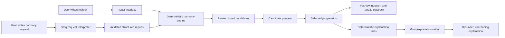

# Chord Finder Architecture

Chord Finder is an interactive music application that turns a four-measure melody into ranked, playable chord-progression options. Users can write notes on a staff, generate harmony, preview alternatives, revise the result in natural language, apply exact chord edits, and hear the melody and chords together.

The application is designed around one central rule:

> The language model interprets user intent, while deterministic TypeScript code makes all musical decisions.

This boundary keeps chord generation reproducible, testable, and independent from model hallucinations.

---

## System overview

Chord Finder is built with:

- Next.js and React
- TypeScript
- VexFlow for music notation
- Tone.js for playback
- Groq for natural-language interpretation and explanation
- Vitest for automated testing

The application has three main layers:

1. **Interface and interaction**
2. **Deterministic harmony engine**
3. **Natural-language services**

---

## Core architectural boundary

Groq does not generate chord progressions.

The language model may interpret:

- whether the user wants a new progression or a revision;
- whether the user wants a simple or jazzy result;
- relative requests such as “make it jazzier”;
- exact requests such as “change measure 2 to Am7”;
- whether a request is unsupported or requires clarification;
- whether the user is asking a question rather than requesting a change.

The deterministic TypeScript engine controls:

- available chords;
- chord construction;
- melody-fit scoring;
- harmonic scoring;
- cadence scoring;
- candidate diversity;
- exact-edit validation;
- chord voicing;
- playability constraints;
- Roman-numeral analysis;
- preview and commit behavior.

This prevents the language model from inventing chords, changing execution order, or claiming that an edit succeeded when the resulting progression does not contain it.

---

## Request flow

A harmony request follows one of four main paths.

### Generate a new progression

A new-generation request produces a ranked candidate set.

Examples:

- “Generate a progression.”
- “Give me something jazzy.”
- A blank request when no progression exists.

The engine:

1. analyzes the melody and active key;
2. builds a pool of possible progressions;
3. scores and validates them;
4. removes duplicate or invalid results;
5. selects candidates representing different roles;
6. voices the surviving progressions;
7. opens candidate-preview mode.

### Revise an existing progression

A revision uses the committed progression as a comparison point.

Examples:

- “Make this jazzier.”
- “Simplify it.”
- “Give me a different version.”

The current progression influences candidate distance, but it is not treated as an unchangeable template unless the request includes an explicit constraint.

### Apply an exact edit

Requests with one deterministic result bypass creative candidate generation.

Examples:

- “Change measure 2 to F.”
- “Copy measure 1 to measure 4.”
- “Set the progression to F–G–C–G.”

Supported exact edits are parsed, validated, applied as one transaction, re-voiced, and committed.

If any part of a multi-edit request is invalid or conflicting, the entire transaction is rejected instead of partially applying the request.

### Answer a question

Explanation requests do not modify the progression.

Examples:

- “Why did you choose G7?”
- “Why is this candidate the best fit?”
- “Explain the transition from Am to E7.”

The application first builds deterministic facts about the actual progression. Groq may turn those facts into readable prose, but it is not allowed to introduce unsupported musical claims.

---

## Candidate preview and commit model

Creative requests produce temporary candidate previews.

Each candidate contains:

- a symbolic progression;
- a voiced progression;
- its candidate role;
- a stable identity;
- deterministic explanation facts;
- information about its relationship to the current progression.

Previewing and committing are intentionally separate operations.

### Preview

When the user clicks a candidate:

- the staff displays that candidate;
- playback uses that candidate;
- the committed progression does not change;
- no permanent history entry is created.

### Select

Selecting a candidate:

- commits the previewed progression;
- records one history entry;
- updates the active interpretation and explanation context;
- closes candidate-preview mode.

### Cancel

Cancelling:

- restores the exact progression from before preview mode opened;
- restores its voicing and interpretation state;
- creates no history entry.

Earlier candidate sets remain visible in the conversation and may be reopened as new preview transactions.

---

## Harmony engine

The harmony engine is organized as pure or mostly pure TypeScript modules.

### Chord generation and scoring

The music modules generate chord candidates and score them using factors such as:

- melody-note support;
- metric importance;
- consonance and dissonance;
- non-chord-tone resolution;
- harmonic function;
- cadence strength;
- voice leading;
- user-requested style preferences.

The term **Best Fit** means the highest-ranked valid result under these explicit heuristics. It does not mean that the progression is objectively or universally the best musical choice.

### Candidate construction

Candidate modules handle:

- building the candidate pool;
- identifying duplicate progressions;
- calculating symbolic distance;
- validating requested constraints;
- assigning candidate roles;
- preserving stable candidate identities.

The interface may show fewer than three candidates when fewer than three sufficiently distinct, valid results survive validation.

### Voicing

Symbolic chord selection and note voicing are separate stages.

After a progression is selected or edited, the voicing system places chord tones within defined ranges and spacing limits. This allows the same symbolic progression to be evaluated independently from its final playable arrangement.

### Exact-edit transactions

Exact edits are validated before they affect application state.

The transaction layer checks:

- measure ranges;
- supported chord names;
- conflicting edits;
- invalid copy operations;
- incomplete requests;
- whether the final result still satisfies every requested edit.

This avoids partially applying a request such as changing one chord while silently ignoring another invalid clause.

---

## Interface architecture

`Staff.tsx` currently acts as the primary orchestration component. It coordinates:

- melody state;
- active key and mode;
- note-entry controls;
- harmony requests;
- candidate state;
- progression history;
- explanation requests;
- playback;
- notation rendering.

Several responsibilities have been extracted into focused components and hooks, including:

- harmony chat rendering;
- toolbar controls;
- playback controls;
- staff rendering;
- candidate-preview state;
- harmony history and commit state;
- message management;
- pitch spelling;
- staff geometry.

A future refactor may reduce `Staff.tsx` further by moving melody-editor behavior and request orchestration into separate controllers. This is an organizational improvement rather than a change to the underlying architecture.

---

## API boundaries

The application uses server-side Next.js routes for Groq requests so the API key is never exposed to the browser.

The interpretation route:

- limits request size;
- sanitizes progression context;
- uses a strict structured-output schema;
- validates all returned actions;
- rejects unsupported or incomplete operations;
- applies timeouts and limited retries;
- returns safe clarification responses on failure.

The explanation route:

- accepts only the final progression and deterministic facts;
- prevents the model from changing chord identities;
- matches explanations back to measures;
- replaces unsupported claims with neutral deterministic text.

---

## Testing strategy

The repository emphasizes unit and state-level testing around the most failure-prone behavior.

Tests cover areas including:

- chord generation and scoring;
- voicing and playability;
- request interpretation;
- strict model schemas;
- exact-edit parsing;
- transaction validation;
- candidate identity and distance;
- candidate-role selection;
- preview, select, and cancel behavior;
- style boundaries;
- progression history;
- grounded explanation facts;
- harmony chat rendering.

An end-to-end browser test is planned to verify the complete user flow from melody entry through generation, preview, selection, playback, and exact revision.

---

## Current limitations

Chord Finder is an actively developed portfolio project. Current limitations include:

- harmony is limited to a four-measure 4/4 workflow;
- only a focused set of exact natural-language edits is supported;
- key and mode changes are handled through interface controls rather than chat;
- transposition through chat is not yet supported;
- ranking weights are based on explicit music-theory heuristics rather than a large human-preference dataset;
- progression history is session-based rather than stored in a database;
- public API rate limiting still needs to be added before supporting significant external traffic;
- browser-level end-to-end test coverage is still being added.

These constraints are intentionally surfaced rather than hidden or approximated by the language model.

---

## Design priorities

The current architecture favors:

1. deterministic behavior over model autonomy;
2. complete request handling over partial execution;
3. preview safety over implicit state changes;
4. grounded explanations over fluent but unsupported theory;
5. testable domain logic over logic embedded in React components;
6. explicit limitations over pretending unsupported functionality exists.
